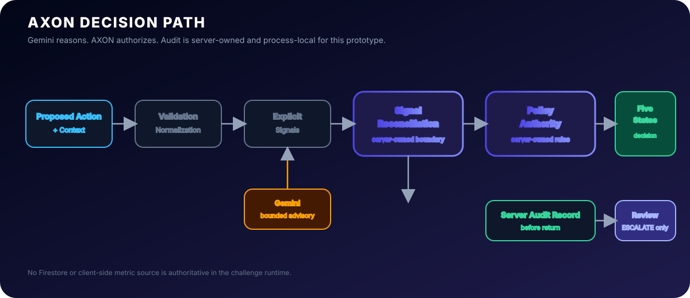

# AXON // The Decision Engine

<p align="center">
  
</p>

<p align="center">
  
  
  
  
  
</p>

> **"Can you build an AI system that knows when it is allowed to act?"**

## Professional Overview

**AXON** is a production-quality, bilingual security governance and operational decision safety engine. It empowers high-integrity organizations to evaluate, safeguard, and audit critical infrastructure actions—such as software dependency upgrades, database schema modifications, server access provisioning, and emergency patches—against rigorous compliance policies before execution.

By serving as a continuous policy verification kernel, AXON acts as the ultimate gatekeeper for autonomous or semi-autonomous infrastructure changes, ensuring that every action is grounded in approved corporate governance.

AXON features native dual-language support in English and Arabic, maintaining high-fidelity Right-to-Left (RTL) design, localized native technical copy, integrated speech-to-text voice input, and robust multi-role simulation flows.

---

## System Architecture

AXON connects client operations with robust policy enforcement. The diagram below illustrates the flow from the client SDK down to the Core Policy Kernel and Gemini AI Model.

<p align="center">
  
</p>

## Core Architectural Pillars

1. **AI Decision Safety Kernel**: Integrates the state-of-the-art Google Gemini model with Google Search Grounding to evaluate actions against defined organizational policies, producing transparent ALLOW, DENY, NEEDS_CLARIFICATION, or ESCALATE_TO_HUMAN rulings with technical explanations.
2. **Operational Guardrails Manager**: Direct, hot-deployable policy definitions written securely in Firestore or local client storage.
3. **Bilingual Dual-Pane Alignment**: Built with an absolute commitment to linguistic accuracy, avoiding machine-style translation in favor of corporate-grade, technical Arabic.
4. **Governance Reviewer Workflow**: Simulates an authorized override and dual-signoff flow for items flagged for human escalation.
5. **Durable Cloud Audit Trial**: Synchronizes historical runs to Google Cloud Firestore with real-time state tracking and fail-safe offline persistence.
6. **Agent SDK**: Provides a drop-in Node.js/TypeScript SDK for other AI agents (like Copilot, Cloud Code, Antigravity) to evaluate action safety programmatically.

---

## Directory Structure

```
├── app/
│   ├── api/
│   │   └── decide/
│   │       └── route.ts         # Server-side Gemini & Google Search Grounding API
│   ├── globals.css              # Tailwind v4 theme and custom variables
│   ├── layout.tsx               # Root Layout with Inter font & Context wrappers
│   └── page.tsx                 # Main interactive AXON governance workspace
├── docs/
│   ├── overview.md              # Detailed technical design & decision logic
│   └── sdk-reference.md         # Documentation for the AXON Developer SDK
├── hooks/
│   └── use-speech.ts            # Web Speech API recognition interface hook
├── lib/
│   ├── axon-sdk.ts              # Agent SDK entry point and class definitions
│   ├── auth-context.tsx         # User simulation profile provider (Operator / Reviewer)
│   ├── firebase.ts              # Lazy Firebase SDK connection with sandbox fallback
│   ├── firestore-service.ts     # Firestore DB queries and LocalStorage failover
│   ├── i18n.tsx                 # Localization definitions and RTL controller
│   ├── scenarios.ts             # Predefined compliance testing scenarios
│   └── utils.ts                 # Tailwind utility helpers
├── metadata.json                # App permissions, name, and capabilities configuration
├── package.json                 # Project dependencies & build instructions
├── postcss.config.mjs           # PostCSS Tailwind config
├── tsconfig.json                # TypeScript configuration
├── PRIVACY.md                   # Enterprise data privacy and security policy
└── TERMS.md                     # Terms of service and governance liability disclaimer
```

---

## Installation & Development

### Prerequisites
- Node.js 18+
- npm or yarn

### Setup Instructions
1. Clone the repository:
   ```bash
   git clone <repository-url>
   cd axon-decision-engine
   ```

2. Install dependencies:
   ```bash
   npm install
   ```

3. Configure environment variables. Create a `.env` or `.env.local` file:
   ```env
   GEMINI_API_KEY=your_gemini_api_key_here
   ```

4. Run the development server:
   ```bash
   npm run dev
   ```
   Open [http://localhost:3000](http://localhost:3000) to view the workspace.

5. Compile production build:
   ```bash
   npm run build
   ```

---

## Technical Features

- **Google Search Grounding**: Every prompt is verified via a live Google Search query to check for package CVEs, version reliability, or technical issues, returning direct web citations in the UI.
- **RTL Language Mirroring**: Generates proper layout orientation shifts when swapping languages, respecting semantic margins, alignment, and typographic density.
- **Robust Fail-Safe State**: If no Firebase credentials are provided or connection fails, AXON falls back immediately to a fully functional sandboxed LocalStorage layer.

## Security & Compliance Disclosure
AXON is an advisory decision-support system. While it helps organizations evaluate operational safety risks, its recommendations do not constitute formal legal or regulatory advice. High-risk decisions should be backed by a certified Human-in-the-Loop clearance.

---

## Project Maintainer

Developed by **Obada Dallo** (عبادة دللو)

- 💼 **LinkedIn**: [linkedin.com/in/obada-dallo-777a47a9](https://www.linkedin.com/in/obada-dallo-777a47a9/)
- 💻 **GitHub**: [github.com/obadadallo95](https://github.com/obadadallo95)
- 🌐 **Portfolio**: [obadadallo.web.app](https://obadadallo.web.app/)
