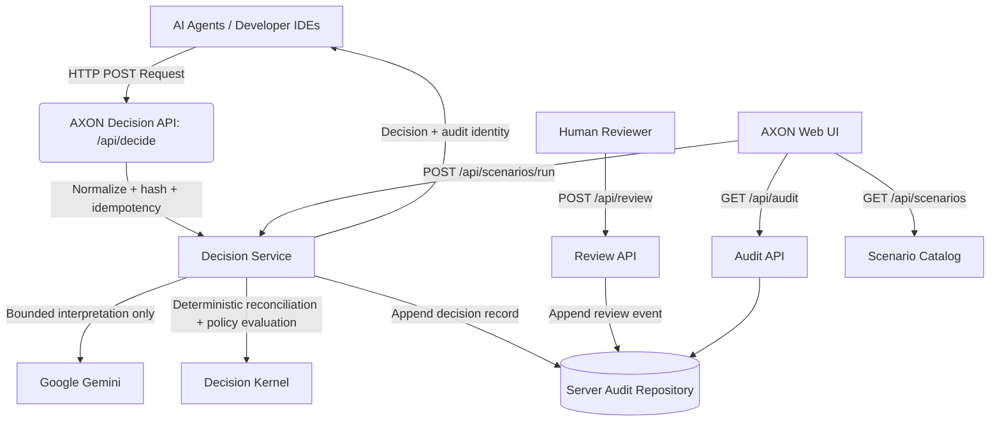

# Architecture & System Design

AXON serves as an external, objective verification layer, decoupling security governance from AI agent execution logic.

The integration boundary is intentionally simple: an agent proposes an action, AXON returns a decision and evidence, and an external integration or execution gateway enforces the result before a tool runs. The current challenge build evaluates and records decisions; it does not intercept Codex, Claude, or real tools.

## 1. System Topology



The current repository uses a process-local server-owned repository. It is suitable for local and single-instance demonstrations, but it is not durable across restarts or safe as a shared store across multiple instances.

The authoritative pipeline is:

```text
Proposed Action + Context
→ Validation / Normalization
→ Explicit Signals
→ Bounded Gemini Interpretation
→ Signal Reconciliation
→ Server-Owned Policy Authority
→ Five-State Decision
→ Server Audit Record
```

`ESCALATE` may append a review event. Gemini reasons; AXON authorizes. No real execution layer or Firestore/Postgres authoritative store is implemented in this challenge runtime.

## 2. The Core Workflow (`server/decision-service.ts`)

The Next.js route is intentionally thin. `server/decision-service.ts` owns the request lifecycle and writes the audit record before returning the decision.

- **Normalization and idempotency**: Requests and policy rules are normalized and hashed. A structured request may supply an idempotency key; legacy requests receive a request-scoped compatibility key.
- **Policy authority**: `server/policy-registry.ts` validates the three typed domains and selects server-owned rules. Public callers cannot inject rules; legacy prose has unresolved coverage and cannot execute. Enabled rules require their named evidence IDs even when unmatched. See [Decision authority](decision-authority.md).
- **Bounded interpretation**: Gemini receives the request, explicit signals, evidence, and policy summaries. Its output is advisory and cannot select the final state.
- **Deterministic authority**: Explicit signals are reconciled with advisory interpretation, then the policy kernel selects `EXECUTE`, `ASK`, `DEFER`, `ESCALATE`, or `REFUSE`.
- **Audit-before-return**: The service appends a decision record containing normalized input, signals, policy authority, outcome, model metadata, and integrity hashes before returning a normal result.
- **Failure safety**: If the audit write fails, normal `EXECUTE` is withheld and the response exposes `AUDIT_WRITE_FAILED`.

## 3. Server-Owned Audit and Review (`server/audit-repository.ts`)

`server/audit-repository.ts` exposes append-only decision and review operations. It enforces idempotency conflicts, first-review-wins behavior, review eligibility, and hash linkage from each review event to its parent decision event. There are no authoritative browser writes and no localStorage fallback for decisions.

`lib/firestore-service.ts` remains a browser adapter for policy display/storage and for reading server audit data through `/api/audit`. A durable server-side Firestore/Admin adapter is intentionally deferred; it must provide transactions or equivalent atomic compare-and-set semantics before being used for multi-instance deployment.

## 4. API Boundaries

- **`POST /api/decide`**: Validates structured or legacy input and returns the deterministic outcome plus `auditEventId`, `idempotencyKey`, replay status, and integrity metadata.
- **`POST /api/review`**: Accepts only `APPROVE` or `REJECT` for an existing `ESCALATE` decision. It appends an immutable review event and never changes the original decision record.
- **`GET /api/audit`**: Reads a decision audit trail by `requestId` or lists recent server-owned records for the dashboard.
- **`GET /api/scenarios`**: Returns metadata only for the typed demonstration fixtures.
- **`POST /api/scenarios/run`**: Resolves a fixture ID, runs its domain adapter and policies through the same `DecisionService`, and returns the canonical result plus expected-state comparison and audit identity. The expected state is an assertion for the demo, never an authorization input.

## 5. Domain Scenario Layer

The scenario layer makes the generic kernel concrete without putting domain logic in the route or browser:

```text
typed fixture -> domain adapter -> DecisionRequest + evidence + PolicyRule[]
                                      |
                                      v
                              DecisionService
                                      |
                         deterministic outcome + audit
```

The three domains are code deployment, refund approval, and support-ticket triage. Each has a strict input schema, declarative policy set, evidence fixtures, and five boundary cases. Adapters map domain facts to the generic fields (`requiredFacts`, `requiredApprovals`, reversibility, blast radius, cost of wrong, and evidence). Gemini remains advisory; if it is unavailable, the kernel and audit workflow remain deterministic and do not grant authority to the model.

The refund fixture `refund-stale-conflicting` is intentionally a failure case: order `4815`, €4,800, stale payment evidence, a contradictory fraud relationship, three chargebacks, and missing finance approval. Signal precedence returns `ESCALATE` rather than silently executing or deferring, while the audit record preserves all conditions.

## 6. The UI Dashboard (`app/page.tsx`)

A React/Next.js interface designed for the challenge flow:
- **Scenario runner**: Three domains and fifteen typed fixtures use the same server workflow as external callers.
- **Decision trace**: The main result shows input, signals, reasoning, outcome, evidence freshness, evidence relationships, and the server audit ID.
- **Review visibility**: Review actions appear only for `ESCALATE`; `APPROVE` and `REJECT` append review events and never mutate the original decision.
- **Truthful integration positioning**: The judge-facing navigation does not expose fabricated SDK telemetry, credentials, webhook persistence, or a client policy editor. AXON exposes a REST API and a source TypeScript client for prototype integration.
- **Bilingual Interface**: RTL-compliant rendering supports English and Arabic.
