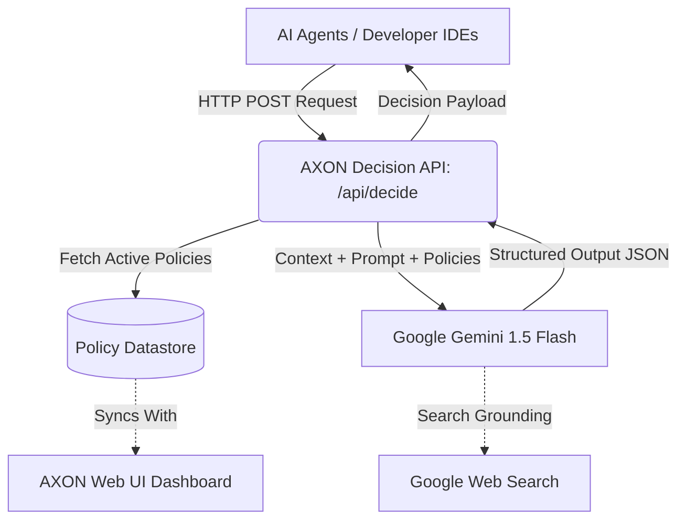

# Architecture & System Design

AXON serves as an external, objective verification layer, decoupling security governance from AI agent execution logic.

## 1. System Topology

## 2. The Core Kernel (`app/api/decide/route.ts`)

The decision kernel is an ultra-fast Next.js Serverless Route. It is the only component that interfaces with the external LLM.

- **Authentication**: Checks for `Bearer` tokens matching `AXON_API_KEY`. Provides seamless bypasses for the local web UI.
- **LLM Engine**: Uses `@google/genai` to invoke `gemini-1.5-flash`.
- **Search Grounding**: The engine is configured with Google Search Grounding to verify packages, CVEs, and real-time world knowledge (e.g. "Is npm package 'X' currently compromised?").
- **Schema Enforcement**: Utilizing `Type.OBJECT`, the route forces the LLM to reply with a strictly parsed JSON payload matching the `DecisionResult` interface.

## 3. Data Persistence (`lib/firestore-service.ts`)

AXON implements a dual-layer, fail-safe storage architecture for compliance policies and audit logs:
1. **Primary**: Google Cloud Firestore.
2. **Fallback**: If Firestore is unreachable or unconfigured, the data layer automatically degrades gracefully into `localStorage`, ensuring the application remains functional for local testing and simulation without requiring complex cloud setups.

## 4. The UI Dashboard (`app/page.tsx`)

A React/Next.js interface designed to give human operators visibility into the system.
- **Policy Management**: Operators can write, toggle, and delete security guardrails.
- **Live Simulator**: A terminal-like interface to directly hit the API endpoint and visualize how the decision engine interprets different payloads.
- **Bilingual Interface**: Absolute RTL-compliant rendering utilizing advanced Tailwind CSS configurations to support both English and Arabic natively.
